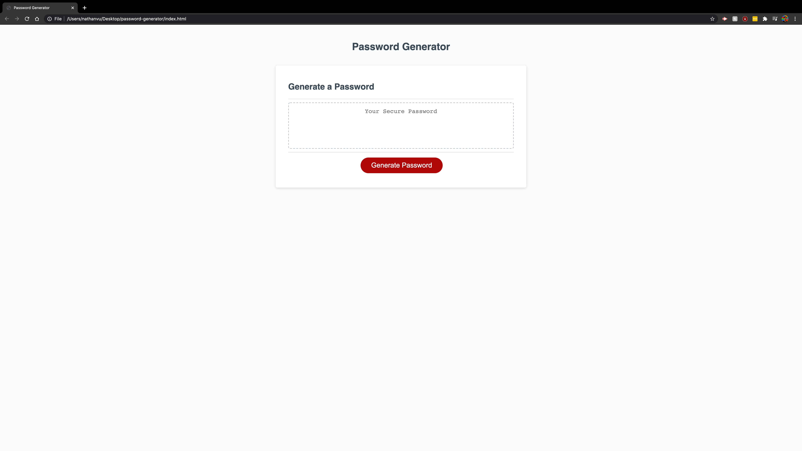
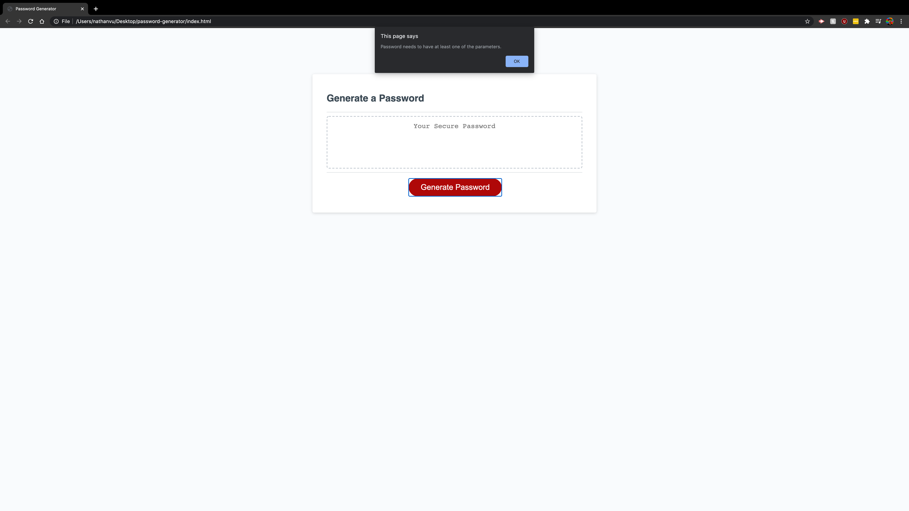
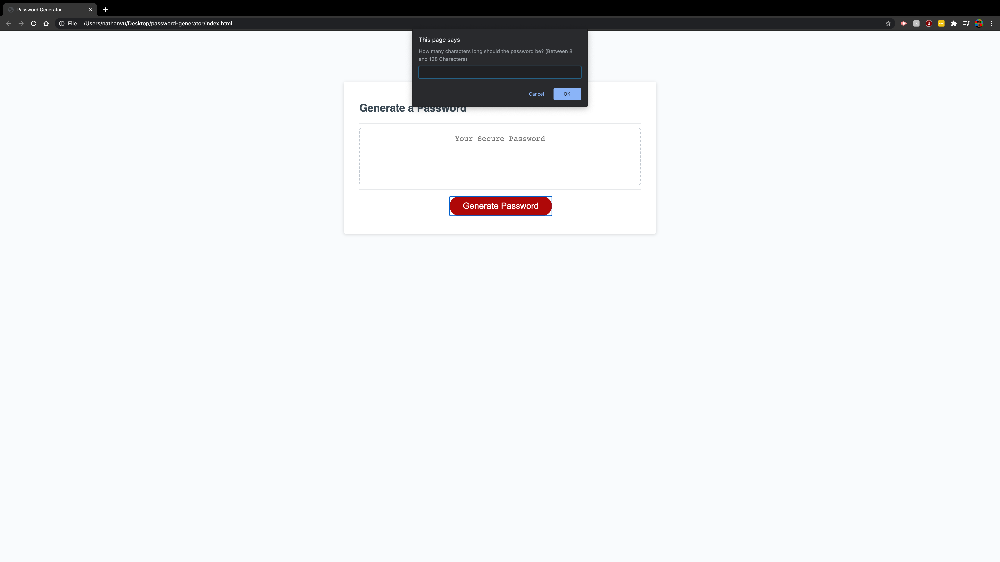
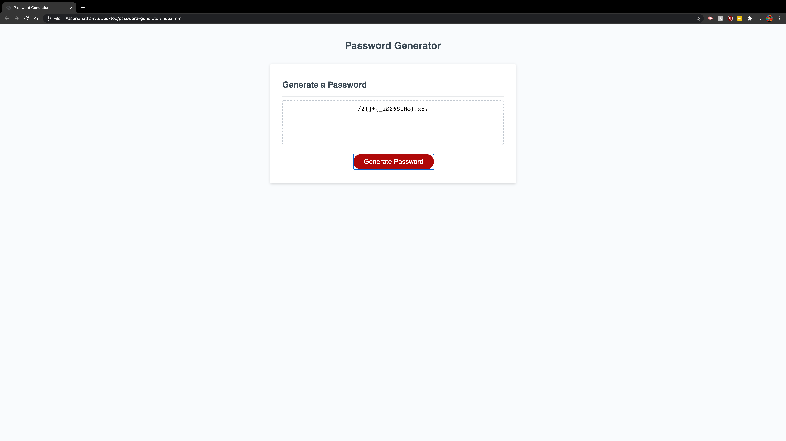

# Password Generator

## Description

Password generator program for a user who wants to protect their sensitive data. Website will ask user to answer a series of prompts regarding the parameters they would like to apply to their generated password. These parameters are whether or not to include:
- Uppercase Letters
- Lowercase Letters
- Numerical Characters
- Special Characters

## Getting Started

* [Github Repository](https://github.com/nathanmvu/password-generator)
* [Deployed Link](https://nathanmvu.github.io/password-generator/)
* [Usage Demo Video](https://drive.google.com/file/d/11JRUf7WHbUROAIat1_pLVHpqN8sp1kWM/view)

### Usage

To use the password generator the user can click the generate password which will initiate a series of prompts asking the user about the parameters they would like to apply to the password and how long the password will be. 

If the user chooses not to select any parameters a password cannot be generated and so the page will ask the user again until they select at least one parameter to apply to their generated password. 

If the user, however, decides to select at least parameter but does not enter a value for the length of the password or enters a number outside of the range of 8 - 128 then they will be prompted again to input a proper value for password length.

### Screenshots

Initial Page:

First Prompt:

No Parameters Selected:

Password Length:

Password Length Invalid:

Successfully Generated Password:

## Author

* **Nathan Vu** - [Github Profile](https://github.com/nathanmvu)

## Acknowledgments

* Project parameters provided by the UCB Extension Coding Bootcamp

## License

This project is licensed under the MIT License 

